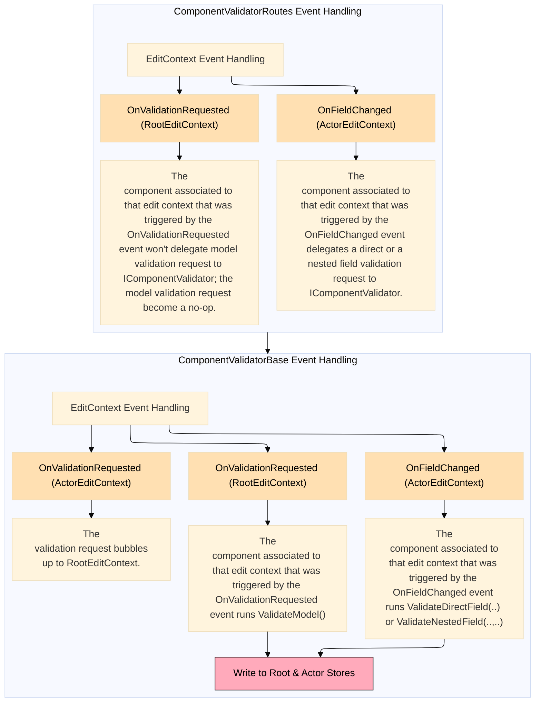

<!-- omit from toc -->
# :microscope: Component Validator Flow Logic 

<!-- omit from toc -->
## Table of Contents

- [Component Interaction](#component-interaction)
- [Event Handling](#event-handling)

## Component Interaction

```mermaid
---
config:
  layout: dagre
  theme: base
  look: classic
---
flowchart TD
 subgraph s2["ValidationMessageStore Handling"]
        RegisterStores["ValidationMessageStore Handling"]
        RootStore["Register new indepdendent ValidationMessageStore to RootEditContext"]
        ActorVsSuper{"ActorEditContext ≠ AncestorEditContext?"}
        RegisterActorStore["Also register new indepdendent ValidationMessageStore to ActorEditContext"]
        SkipActorStore["Skip ActorEditContext ValidationMessageStore"]
        n2["Inherits from ComponentValidatorBase?"]
  end
 subgraph s3["Resolve ActorEditContext"]
        ActorDefined{"ActorEditContext already defined?"}
        SetActorAsSuper["Set ActorEditContext = AncestorEditContext"]
        UseActor["Use explicit or created ActorEditContext"]
        CascadeActor["Cascade ActorEditContext further down the component graph via CascadedValue"]
        StoreRoot["Write RootEditContext to ActorEditContext Properties[RootEditContextKey]"]
  end
 subgraph s4["Resolve RootEditContext"]
        CheckRootKey{"Does AncestorEditContext Properties[RootEditContextKey] exist?"}
        UseExistingRoot["Set RootEditContext = found RootEditContext"]
        UseSuperAsRoot["Set RootEditContext = AncestorEditContext"]
        StoreRootToSuper["Store RootEditContext to AncestorEditContext Properties[RootEditContextKey]"]
  end
 subgraph s1["Sub Event Handling"]
        SubVR["Subscribe OnValidationRequested (RootEditContext)"]
        SubFC["Subscribe OnFieldChanged (ActorEditContext)"]
        BubbleCheck{"ActorEditContext ≠ AncestorEditContext?"}
        BubbleVR["Subscribe OnValidationRequested (ActorEditContext) → bubble up to RootEditContext"]
  end
 subgraph s6["ComponentValidatorSubpath"]
        Subpath["ComponentValidatorSubpath"]
        SubCtxCheck{"ActorEditContext / Model?"}
        ErrorBoth["❌ ERROR: Both EditContext and Model set"]
        ErrorNone["❌ ERROR: Neither EditContext nor Model set"]
        CreateCtx["Create new EditContext from set Model"]
        UseCtx["Use EditContext as-is"]
        Stop2(("Throw error"))
        n3["Continue component initialization"]
  end
 subgraph s7["ComponentValidatorRoutes"]
        StartRoutes[["Cascaded IComponentValidator from Rootpath or Subpath ancestor"]]
        RoutesComponent["ComponentValidatorRoutes"]
        RoutesComponentActor["Always provide ActorEditContext via model sentinel"]
  end
 subgraph componentValdatorBase["ComponentValidatorBase"]
        n39["Begin component initialization"]
        componentValidatorClassGraph["componentValidatorClassGraph"]
        ComponentValidatorBaseEditContextCascadingParameter[["Cascaded EditContext becomes AncestorEditContext"]]
  end
 subgraph componentValidatorBaseNesting["&nbsp;"]
        n36["Allowed Nesting"]
        n37["✅ Rootpath and Subpath can be freely mixed"]
        n38["⚠ Routes must be nested under Rootpath or Subpath"]
  end
 subgraph componentValidatorClassGraph["&nbsp;"]
        ComponentValidatorBaseClass["ComponentValidator[Rootpath, Subpath or Routes]"]
        componentValidatorBaseNesting
  end
    StartRoutes --> RoutesComponent
    RoutesComponent --> RoutesComponentActor
    ComponentValidatorBaseEditContextCascadingParameter --> ComponentValidatorBaseClass
    ComponentValidatorBaseClass --> CheckRootKey
    CheckRootKey -- Yes --> UseExistingRoot
    UseExistingRoot --> ActorDefined
    CheckRootKey -- No --> UseSuperAsRoot
    UseSuperAsRoot --> StoreRootToSuper
    StoreRootToSuper --> ActorDefined
    ActorDefined -- No --> SetActorAsSuper
    ActorDefined -- Yes --> UseActor
    UseActor --> CascadeActor
    SetActorAsSuper --> CascadeActor
    CascadeActor --> StoreRoot
    RegisterStores --> RootStore & ActorVsSuper
    ActorVsSuper -- Yes --> RegisterActorStore
    ActorVsSuper -- No --> SkipActorStore
    SkipActorStore --> SubVR
    SubVR --> SubFC
    SubFC --> BubbleCheck
    BubbleCheck -- Yes --> BubbleVR
    BubbleCheck -- No --> n12["Complete component initialization"]
    Subpath --> SubCtxCheck
    SubCtxCheck -- Both --> ErrorBoth
    SubCtxCheck -- Neither --> ErrorNone
    SubCtxCheck -- OnlyModel --> CreateCtx
    SubCtxCheck -- OnlyEditContext --> UseCtx
    CreateCtx --> n3
    UseCtx --> n3
    ErrorNone --> Stop2
    n2 -- Yes --> RegisterStores
    RegisterActorStore --> SubVR
    StoreRoot --> n2
    n2 -- No --> SubVR
    ErrorBoth --> Stop2
    BubbleVR --> n12
    n36 --> n37 & n38
    n3 --> ComponentValidatorBaseClass & n39
    n39 --> ComponentValidatorBaseClass
    RoutesComponentActor --> n39
    n2@{ shape: diam}
    n3@{ shape: rect}
    n39@{ shape: rect}
    n36@{ shape: rect}
    n37@{ shape: rect}
    n38@{ shape: rect}
    style ActorVsSuper fill:#C8E6C9,stroke:#000,stroke-width:1px,color:#000000
    style n2 fill:#C8E6C9,color:#000000
    style ActorDefined fill:#C8E6C9,color:#000000
    style CheckRootKey fill:#C8E6C9,stroke:#000,stroke-width:1px,color:#000000
    style BubbleCheck fill:#C8E6C9,stroke:#000,stroke-width:1px,color:#000000
    style Subpath fill:#E1BEE7,color:#000000
    style SubCtxCheck fill:#C8E6C9,color:#000000
    style Stop2 fill:#FFE0B2
    style n3 fill:#FFE0B2
    style StartRoutes fill:#BBDEFB,stroke:#000,stroke-width:1px,color:#000000
    style RoutesComponent fill:#E1BEE7,color:#000000
    style n39 fill:#FFE0B2
    style ComponentValidatorBaseEditContextCascadingParameter fill:#BBDEFB,stroke:#000,stroke-width:1px,color:#000000
    style n36 fill:#FFF9C4,stroke:#000,color:#000000
    style n37 fill:#dfd,color:#000000
    style n38 fill:#fdd,color:#000000
    style ComponentValidatorBaseClass fill:#E1BEE7,stroke:#000,stroke-width:1px,color:#000000
    style componentValidatorBaseNesting fill:transparent
    style n12 fill:#FFE0B2
```

## Event Handling

